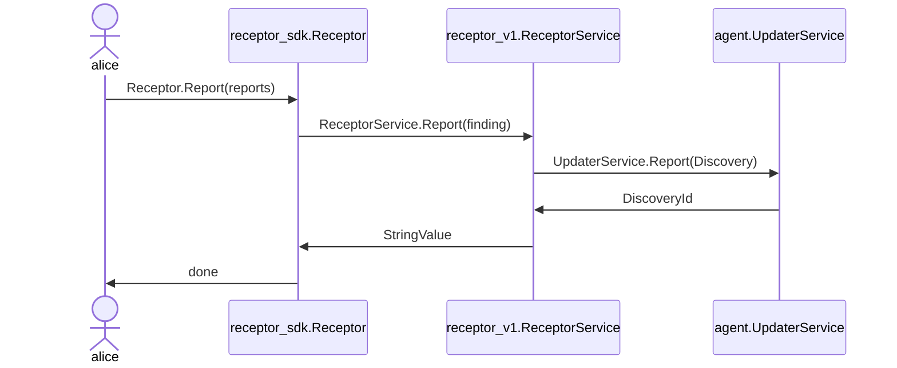
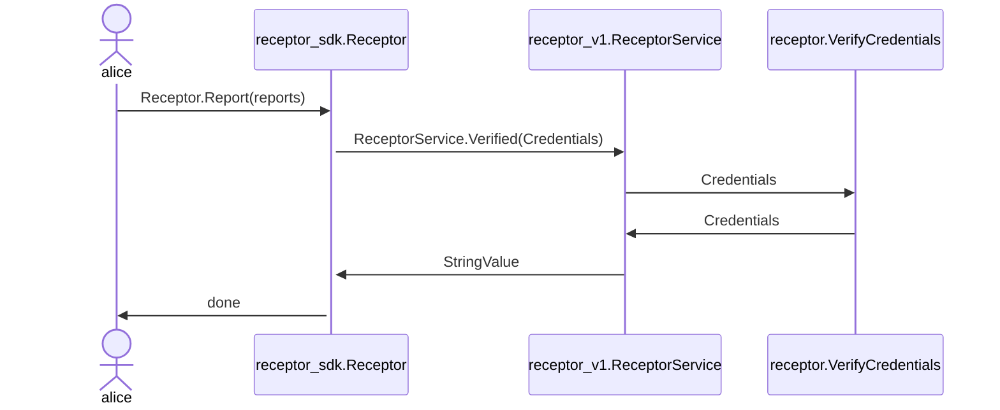
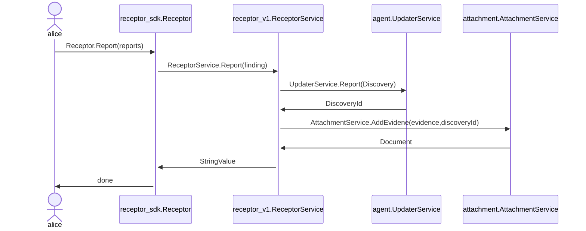
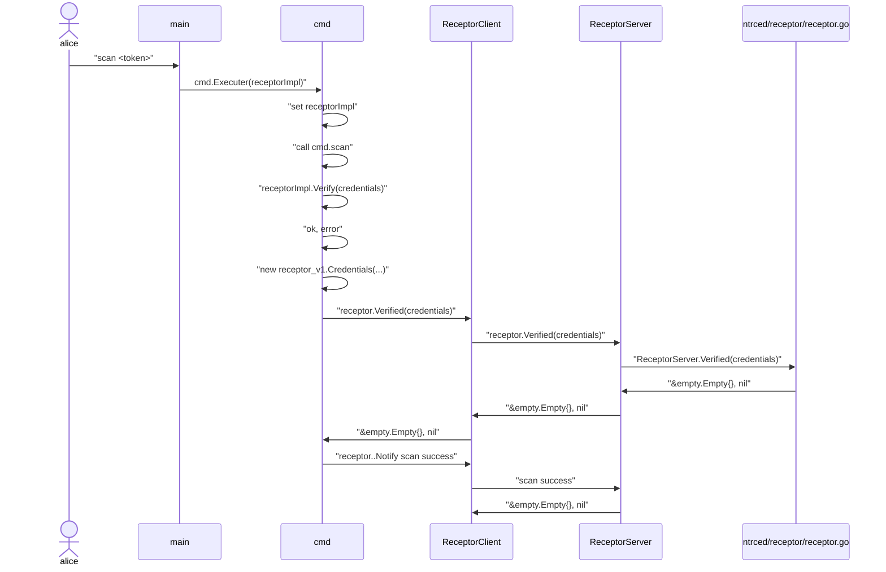

# API
An API to interface with the Trustero platform

# Diagrams

## Discovered

### Verified


## Report



### Appendix A: Legacy implementation of Scan

```mermaid
sequenceDiagram

    actor alice
    participant cmd
    participant Receptor
       
    alice ->> cmd: %> scan <token>
    cmd ->> Receptor: Scan(credentials)
    Receptor ->> cmd: []*agent.Services
    cmd ->> agent.UpdaterService.Report(): []*agent.Services
    agent.UpdaterService.Report() ->> cmd: DiscoveryId
    cmd ->> Receptor: FindEvidence([]*agent.Services)
    Receptor ->> cmd: []*evidence.Evidence
    cmd ->> attachment.AttachmentService.AddEvidence(): (evidence,discoveryId)
    attachment.AttachmentService.AddEvidence() ->>cmd: Document
    cmd ->> alice: done
```

## Message Passing example: Scan
